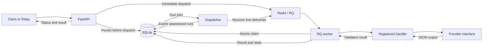

# Agent Runtime

## Thesis

Agent Runtime is execution infrastructure for reliable AI workflows: queued asynchronous execution, bounded retries, structured-output validation, cancellation, idempotency, and telemetry behind a provider-agnostic API. It runs standalone; Relay is a reference application that can delegate approved work to it.

## Problem

An HTTP request to a model is not an execution system. Applications need to survive transient provider failures, inspect work after a client disconnects, and distinguish a cancelled execution from a completed external effect. Agent Runtime separates those concerns from application planning and workflow meaning.

## Architecture



The API, worker, and dispatcher share one SQLite database. Redis transports work; it is not the execution source of truth. See [execution and retry sequences](docs/architecture.md).

## Execution lifecycle

`queued → running → completed`, with `failed`, `cancelled`, and `timed_out` outcomes. Retryable failures return to `queued` with a persisted due time. `completed` is the public API's success status.

A job records its ID, handler (`workflow_type`), input/output, timestamps, attempt count, retry budget, correlation ID, idempotency key, and typed failure. Conditional status/attempt updates prevent stale workers from publishing results over newer state.

## Reliability guarantees / behavior

| Concern | Implemented behavior |
| --- | --- |
| Submission | Persist before enqueue. A Redis outage can still return 202 because the dispatcher can deliver the saved job later. |
| Delivery | Due jobs are redispatched after a lease expires. Queue delivery can repeat; only one worker can claim a given attempt. Progress requires a healthy database, dispatcher, Redis, and worker. |
| Retries | Connection/5xx failures, rate limits, and provider timeouts retry up to `max_retries` (default 2, maximum 5). Delay is `min(cap, base × 2^retry_count)` before incrementing the count; defaults are 60s and 5s. SDK retries are disabled. |
| Permanent failures | Invalid input is rejected before enqueue. Invalid output and unexpected internal errors fail without automatic retry. Manual retry never resets the budget and rejects ineligible jobs. |
| Idempotency | A caller-owned key plus a hash of the validated request resolves duplicates to one job. Reusing a key with different input, retry budget, or execution timeout returns 409. Keys are database-wide and retained with job history. No key means a new job. |
| Timeouts | Provider/network timeout defaults to 60s. Execution timeout defaults to 300s per attempt and is enforced by RQ. The dispatcher expires abandoned running records after their deadline. HTTP disconnects do not cancel jobs; queue wait has no expiry. |
| Cancellation | Cancels queued/running state, prevents subsequent attempts and late result publication, and leaves terminal jobs unchanged. It cannot undo or reliably interrupt an in-flight provider request. |
| External effects | A provider timeout can have an unknown external outcome. Retries may repeat calls; downstream effects need their own idempotency support. There is no exactly-once external-effect guarantee. |

## Provider abstraction

Handlers depend on `AIProvider.generate_json`, with an OpenAI adapter and deterministic `MockAIProvider`. With no API key, local execution uses the mock. Vendor exceptions are normalized inside the adapter; Pydantic validates handler output before success is persisted. Schema validity does not establish factual correctness.

The explicit registry includes `summarize_text`, `extract_structured_data`, and `classify_message` as small, generic examples. Requests cannot select arbitrary Python imports or commands. See [API contracts and examples](docs/api.md).

## Observability

The dashboard shows persisted jobs, statuses, attempts, timestamps, handlers, payloads, errors, and transition logs. JSON process logs include execution/correlation IDs, attempt, handler, status, safe error codes, and latency; provider-start logs name the adapter.

`/metrics` exposes Prometheus-compatible **snapshot gauges**, including legacy names ending in `_total`. `/metrics-summary` supplies dashboard aggregates. Success rate is completed jobs divided by all jobs; retries count scheduled retries; latency summarizes each job's most recent recorded attempt. These are not cumulative latency histograms or measured throughput benchmarks.

## Relay integration

**Relay → RuntimeClient / HTTP → Agent Runtime → queued execution.**

| Relay owns | Agent Runtime owns |
| --- | --- |
| Workflow meaning, planning, approvals, user-facing state | Queueing, workers, retries, execution timeouts, cancellation state, runtime telemetry |

Relay should reuse an idempotency key for retries of the same approved operation, propagate a correlation ID, and retrieve/cancel via `/jobs`. Agent Runtime does not import or call Relay. The `RuntimeClient` / `AgentRuntimeHttpClient` definitions are not in this repository, so direct Relay compatibility is **unverified**, not an implemented end-to-end integration claim.

## Tech stack

Python 3.12 · FastAPI · SQLAlchemy/SQLite · Redis 7/RQ · Pydantic · OpenAI/mock adapters · React/TypeScript/Vite · Docker Compose · GitHub Actions.

## Local setup

Install and start Docker with Compose v2 or newer. From the repository root:

```bash
cp .env.example .env  # First run only; preserve an existing .env
# Leave OPENAI_API_KEY blank to use the deterministic mock provider.
docker compose up --build
```

Open the [dashboard](http://localhost:5173), [API docs](http://localhost:8000/docs), or [metrics](http://localhost:8000/metrics). Compose starts Redis, the API, worker, dispatcher, and dashboard. For API-only use, run `docker compose up --build backend worker dispatcher`.

Stop with Ctrl+C, then `docker compose down`. SQLite history remains in `./data`; Redis uses a named volume. Add a real key only to your ignored `.env` when you want billable provider calls, then recreate services with `docker compose up --build`.

See [development setup](docs/development.md) for native Python/Redis commands, environment defaults, Windows guidance, and troubleshooting.

## Testing

From the root, after creating and activating a Python 3.12 virtual environment:

```bash
python -m pip install -r backend/requirements-dev.txt
python -m pytest -q
ruff check backend
ruff format --check backend
npm --prefix frontend ci
npm --prefix frontend run build
```

Node 22.12+ is required for the frontend. Its build runs TypeScript checking followed by Vite bundling; backend static type checking is not configured. Tests use temporary databases, fake providers, mocked SDK responses, and queue stubs—no model API key or live Redis is required. Coverage includes concurrent idempotency, duplicate delivery, retries/backoff, invalid output, cancellation races, timeout recovery, HTTP contracts, and schema migration.

[CI](.github/workflows/ci.yml) runs these gates plus Compose validation and backend/frontend image builds. Building images is not a live Redis/RQ integration test.

## Engineering decisions

Four [decision records](docs/decisions.md) explain the tradeoffs:

1. Asynchronous RQ workers and a separate dispatcher.
2. SQLite execution state, durable pending work, and idempotency.
3. Provider isolation and structured-output validation.
4. Bounded retry/cancellation semantics and the application/runtime boundary.

## Known limitations

- Single-host SQLite with short write transactions; no multi-host database topology, high-availability guarantee, or network-filesystem support. Back up the database and stop old processes before schema upgrades.
- No built-in authentication, tenant isolation, or quotas. Compose binds the API/dashboard to localhost and keeps Redis internal. Remote use requires an authenticated TLS gateway and access controls.
- Inputs and outputs are retained in SQLite and returned by the API. Safe logging does not make stored payloads non-sensitive; there is no retention or encryption-at-rest policy built into the app.
- Recovery depends on the dispatcher being alive. Execution timeout does not roll back external effects; cancellation does not terminate every in-flight provider call.
- History lists the latest 100 jobs. Dashboard submission keys survive failed retries in the current page session, not reloads. `/health` is liveness, not worker/Redis readiness.
- Built-in handlers are examples, not a workflow DSL or general tool-execution platform. Relay interoperability and live-provider behavior need separate integration validation.
