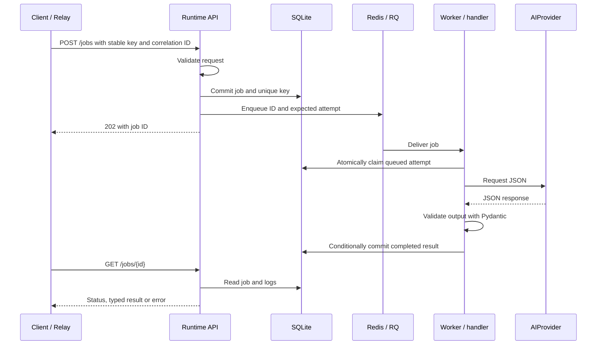
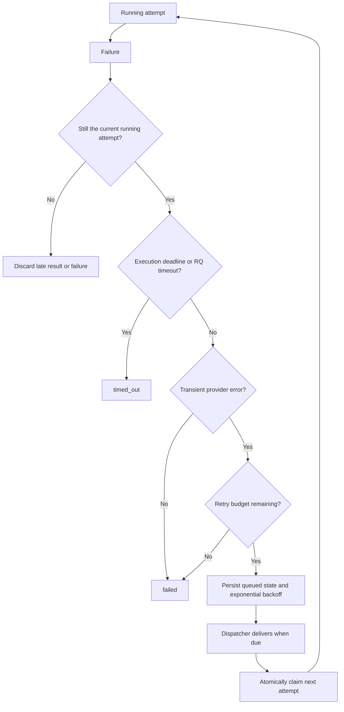

# Execution and failure paths

The [README system diagram](../README.md#architecture) shows process boundaries. The sequences below explain ordering and recovery without introducing additional components.

## Successful execution

Enqueue is outside the database transaction. The dispatcher scans due queued records and resends after the dispatch lease expires, covering a crash on either side of enqueue. A duplicate queue message does not bypass the atomic claim. An idempotent resubmission returns the existing job, which may already be running or terminal.

## Failure and retry

`JobService` owns transitions. Failure decisions and status writes are fenced by status and attempt number, so cancellation or a newer attempt can win a race. `retry_count` increments when scheduling a retry; `attempt_count` increments when a worker claims it. Provider SDK retries are disabled to avoid an invisible second retry budget.

If a worker dies without recording failure, the dispatcher marks the abandoned run `timed_out` after its persisted deadline. It does not automatically replay that unknown external outcome. A Redis outage delays dispatch, not the persisted acceptance of a job. Neither queue recovery nor cancellation can reverse external effects.
